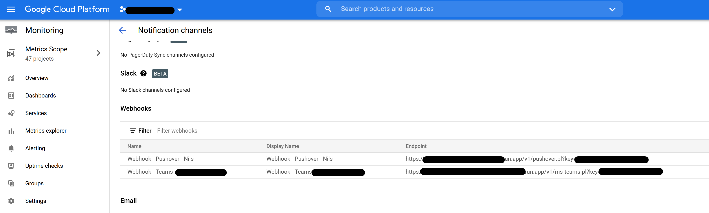

# Google Cloud Run

Deploy the [HTTP API](https://github.com/Cyclenerd/notify-me/tree/master/http) as highly scalable containerized applications on a fully managed serverless platform.

You can use the service to get notified about Google Cloud Platform Monitoring alerts.
Add the HTTP API URL as a webhook endpoint for this task.



## Setup

You need a Bash shell and the [Google Cloud SDK](https://cloud.google.com/sdk/docs/install).
You can also use your [Cloud Shell](https://cloud.google.com/shell/docs/using-cloud-shell).

Clone:
```shell
git clone https://github.com/Cyclenerd/notify-me.git
cd notify-me/gcp_cloud_run/
```

### Config

Overwrite default configuration:

```shell
# Get default configuration
cat default_config

# Change API key
echo "API_KEY='$(echo $RANDOM | md5sum | head -c 20)'" >> my_config

# Change project ID
echo "MY_GCP_PROJECT='my-project-id'" >> my_config

# Change region
echo "MY_GCP_REGION='europe-north1'" >> my_config
```

### Create Artifact Registry 

**Create a new Artifact Registry repository for Docker images:**
```
bash 01_create_docker_registry.sh
```

### Copy Docker image

**Copy Docker image from GitHub Container Registry to Artifact Registry:**
```
bash 02_copy_docker_image.sh
```

💡 You can always repeat this step to copy and mirror the Docker image.

The tool `gcrane` from [go-containerregistry](https://github.com/google/go-containerregistry/blob/main/cmd/gcrane/README.md) is used to copy the image.
If you don't have it installed, the script will try to install it under `/usr/local/bin/`.

### Deploy Cloud Run service

Pass options as [environment variables](https://github.com/Cyclenerd/notify-me#environment-variables) to Cloud Run container service:
```
# Example for token parameter
echo "APP_TOKEN='bla-fa'" >> my_config
```

**Deploy container to Cloud Run service and test HTTP API:**
```
bash 03_deploy_cloud_run.sh
```

💡 You can always repeat this step to update the Cloud Run container.

### Done

You can now use the HTTP API to get notified.

## Examples

All other services are deployed ih the same way as explained above.

### Microsoft Teams (`ms-teams.pl`)

**Deploy another Cloud Run service for MS Teams `ms-teams.pl`:**
```shell
# MS Teams webhook url
export APP_URL="https://outlook.office.com/webhook/<group>@<tenantID>/IncomingWebhook/<chars>/<guid>"
# Other Cloud Run service name
export MY_GCP_RUN_SERVICE_NAME="teams"
bash 03_deploy_cloud_run.sh
```

**Test:**
```shell
curl -i \
	-H "Content-Type: application/json" \
	--data @../http/NotifyMe-HTTP/t/google-test.json \
	https://<Cloud Run service URL>/v1/ms-teams.pl?key=$API_KEY
```

### Pushover (`pushover.pl`)

**Deploy another Cloud Run service for Pushover `pushover.pl`:**
```shell
# Pushover
export APP_USER="The user/group key"
export APP_TOKEN="Your applications API token"
# Other Cloud Run service name
export MY_GCP_RUN_SERVICE_NAME="pushover"
bash 03_deploy_cloud_run.sh
```

**Test:**
```shell
curl -i \
	-H "Content-Type: application/json" \
	--data @../http/NotifyMe-HTTP/t/google-test.json \
	https://<Cloud Run service URL>/v1/pushover.pl?key=$API_KEY
```